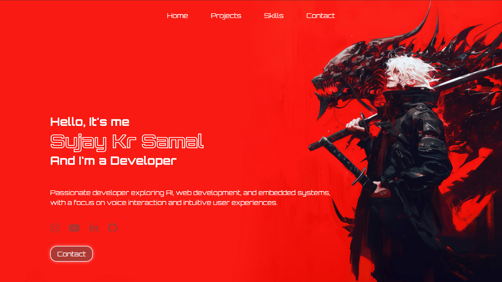
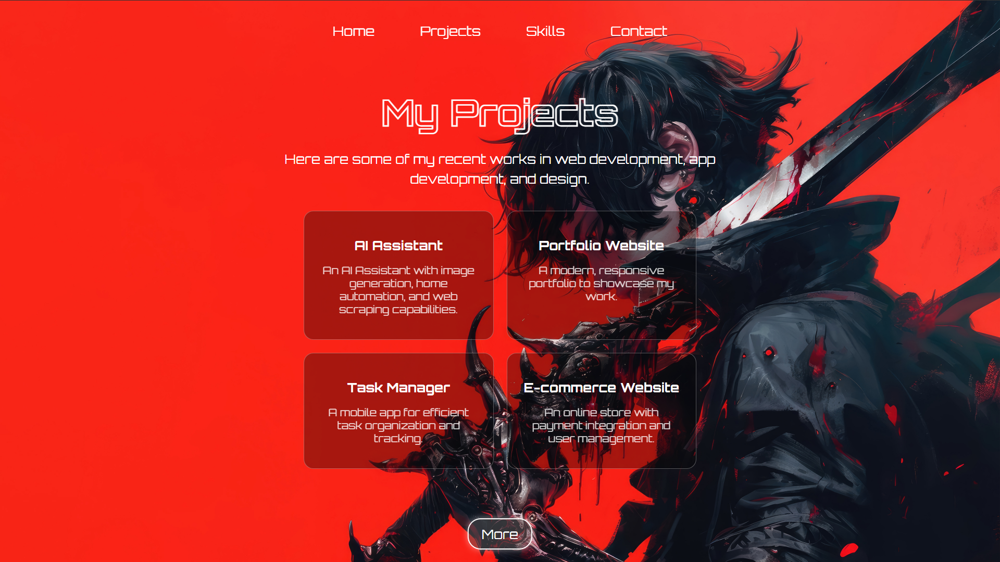

# Sujay Kr Samal — Portfolio

> *Passionate developer exploring AI, web development, and embedded systems.*

A bold, anime-inspired personal portfolio website with a striking red theme — built to showcase projects, skills, and contact info.

🌐 **Live Demo:** [sujay-kr-samal.github.io/Portfolio_1](https://sujay-kr-samal.github.io/Portfolio_1/)

---

## 📸 Preview

### 🏠 Home


### 🚀 Projects


---

## ✨ Features

- 🔴 Bold red-themed design with anime-style hero artwork
- 🧭 Smooth navigation — Home, Projects, Skills, Contact
- 👤 Personal intro with name, role & bio
- 🗂️ Projects showcase — AI Assistant, Portfolio Website, Task Manager, E-commerce Website
- 🔗 Social links — Instagram, YouTube, LinkedIn, GitHub
- 📩 Contact button with direct CTA
- 📱 Fully responsive layout

---

## 🛠️ Tech Stack

| Technology | Usage |
|---|---|
| HTML5 | Structure |
| CSS3 | Styling & Animations |
| JavaScript | Interactivity |
| GitHub Pages | Deployment |

---

## 🚀 Getting Started

```bash
# Clone the repository
git clone https://github.com/sujay-kr-samal/Portfolio_1.git

# Navigate into the project
cd Portfolio_1

# Open in browser
open index.html
```

---

## 📁 Project Structure

```
Portfolio_1/
├── index.html
├── assets/
│   ├── home.png
│   └── projects.png
├── css/
│   └── style.css
└── js/
    └── script.js
```

---

## 🌐 Pages

| Page | Description |
|---|---|
| **Home** | Hero section with intro, bio & social links |
| **Projects** | AI Assistant, Portfolio Website, Task Manager, E-commerce Website |
| **Skills** | Tech stack and abilities |
| **Contact** | Get in touch form or links |

---

## 🗂️ Featured Projects

| Project | Description |
|---|---|
| 🤖 **AI Assistant** | AI with image generation, home automation & web scraping |
| 🌐 **Portfolio Website** | A modern, responsive portfolio to showcase my work |
| ✅ **Task Manager** | A mobile app for efficient task organization and tracking |
| 🛒 **E-commerce Website** | An online store with payment integration and user management |

---

## 👤 Author

**Sujay Kr Samal**
- GitHub: [@sujay-kr-samal](https://github.com/sujay-kr-samal)
- LinkedIn: [Sujay Kr Samal](https://linkedin.com/in/sujay-kr-samal)

---

## 📄 License

This project is open source and available under the [MIT License](LICENSE).

---

<p align="center">Made with ❤️ & 🔴 by Sujay Kr Samal</p>
